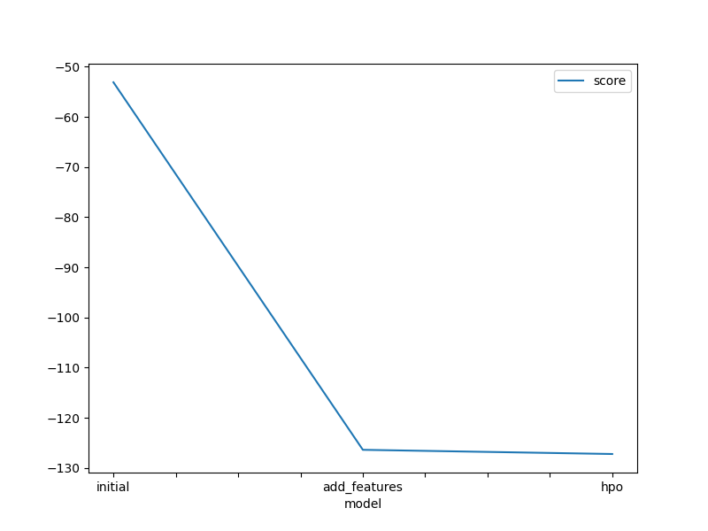
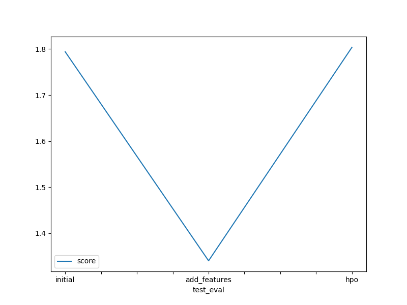

# Report: Predict Bike Sharing Demand with AutoGluon Solution
#### Benjamin Juma Okwako

## Initial Training
### What did you realize when you tried to submit your predictions? What changes were needed to the output of the predictor to submit your results?
All the predictions needed to be non-negative for Kaggle to allow submission.
I had to make changes to the negaative values and turned them into zeros.

### What was the top ranked model that performed?
NeuralNetFastAI_BAG_L1 was the best performing model with a Root_Mean_Sqare_Error of -51.696.

## Exploratory data analysis and feature creation
### What did the exploratory analysis find and how did you add additional features?
- Count, the target variable, followed a logarithmic distribution and not normal distribution. This implies that linear models will not be appropriate as normality assumption is a crucial assumption to fulfil.
- Working Day and Holiday were binary categorical variables.
- Temperature and Humidity followed an almost normal distribution.
- The total number of observations was 10,886.

### How much better did your model preform after adding additional features and why do you think that is?
The model's performance increased significantly, reason being that new features may explain and show patterns in a clear manner compared to the original variable.

## Hyper parameter tuning
### How much better did your model preform after trying different hyper parameters?
It performed better than all the other models. 

### If you were given more time with this dataset, where do you think you would spend more time?
Hyperparameter tuning and feature selection.

### Create a table with the models you ran, the hyperparameters modified, and the kaggle score.
|model|num_bag_folds|num_bag_sets|num_stack_levels|score|
|--|--|--|--|--|
|initial|0|20|0|1.79398|
|add_features|0|20|0|1.34024|
|hpo|5|1|1|1.80378|

### Create a line plot showing the top model score for the three (or more) training runs during the project.

### Create a line plot showing the top kaggle score for the three (or more) prediction submissions during the project.

## Summary
AutoGluon provides a crucial starting for the choice of models, but further improvements needs to be taken after the user gets a hint on the best performing models. This might include focusing on those models that had a higher score.
